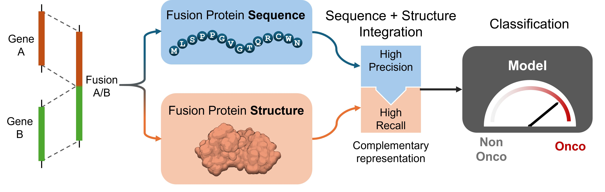

# FusAID



This repository provides a machine learning framework for prioritizing oncogenic fusion proteins by integrating sequence- and structure-based protein representations.

The framework supports four different prediction modes:

* **Sequence model**: classification based exclusively on protein sequence embeddings generated with **FusOn-pLM**.
* **Structure model**: classification based exclusively on protein structure embeddings extracted from predicted protein structures.
* **Concatenation model**: joint prediction using concatenated sequence and structure embeddings.
* **Soft-voting ensemble**: ensemble of the sequence and structure models using a weighted combination of their prediction logits.

The complete training and inference pipeline is implemented in Python using PyTorch and can be executed through command-line interfaces.


## Repository Overview

The repository consists of three main stages:

1. **Data preparation**
   - Prepare a dataframe containing fusion proteins.
   - (Optional) Extract amino acid sequences.

2. **Embedding generation**
   - Compute sequence embeddings using FusOn-pLM.
   - Compute structure embeddings from AlphaFold structures.

3. **Training / inference**
   - Train one of the supported models.
   - Perform prediction on unseen fusion proteins.

---


# Preparing Input Data

The pipeline expects as input a **Pandas DataFrame** stored as a `.pkl` file.

Each row corresponds to a single fusion protein and must have a unique dataframe index. This index is used as the identifier throughout the entire pipeline.

The dataframe should contain:

* the gene names associated with each fusion protein, which are used to generate gene-disjoint training, validation, and test splits;
* the amino acid sequence of each fusion protein;
* the target labels required for training. The framework supports:

  * binary fusion detection (`label ∈ {fusion, wt}`);
  * oncogenicity prediction (`cancer ∈ {Non-Cancer, ...}`), where only fusion proteins are considered;
* any additional metadata required by the application or useful for downstream analyses.


The dataframe index acts as the unique identifier linking every data modality.

---

## Computing aminoacid sequences

If amminoacid sequences are not already available, the repository provides

```text
extract.py
```

to generate the sequence required before running the rest of the pipeline.

### Usage:
```bash
python -m src.extraction.extract_sequence \
    --fasta_path data/genome/hg19.fa \
    --gtf_path data/genome/Homo_sapiens.GRCh37.87.gtf \
    --infile data/raw/data.pkl \
    --outfile data/raw/data_sequence.pkl \
    --transcript_columns transcript_id1,transcript_id2 \
    --breakpoint_columns bp1,bp2 \
    --gene_columns gene1,gene2 \
    --junction ['reject', 'approximate', 'cut']
```

---

# Embedding Generation

The framework operates on precomputed embeddings rather than raw sequences or structures.

## Sequence Embeddings

Sequence embeddings are generated using **FusOn-pLM**.

The script

```text
embed_sequence.py
```

reads the input dataframe, extracts the protein sequences, computes one embedding for each sample, and stores the result as

```text
sequence_embeddings.npz
```

containing:

* `embeddings`
* `indices`

where `indices` correspond to the dataframe indices, allowing embeddings to be matched back to the original samples.

### Usage:
```bash
python -m src.embed.embed_sequence \
    --infile data/raw/data.pkl \
    --outfile data/embeddings/sequence_embeddings.npz \
    --sequence_column sequence
```

---

## Structure Embeddings

Structure embeddings are generated from protein structures stored as `.cif` files.

The script

```text
embed_structure.py
```

expects a directory containing one CIF file for each sample.

Each structure file **must** follow the naming convention

```text
seq_<dataframe_index>.cif
```

For example,

```text
seq_0.cif
seq_15.cif
seq_287.cif
seq_1045.cif
```

where the filename exactly matches the corresponding dataframe index.

The generated embeddings are saved as another `.npz` file containing

* `embeddings`
* `indices`

using the same indexing convention adopted for sequence embeddings.

### Usage:
```bash
python -m src.embed.embed_structure \
    --in_path data/raw/cif \
    --outfile data/embeddings/structure_embeddings.npz
```

---
# Model training and testing

Once both embedding files are available, the training and inference scripts can directly use them without requiring any additional preprocessing.

The framework supports four different learning strategies:

* **Sequence-only model**: uses only sequence embeddings generated by FusOn-pLM.
* **Structure-only model**: uses only structure embeddings extracted from AlphaFold predicted structures.
* **Concatenation model**: combines sequence and structure information by concatenating the two embedding vectors before classification.
* **Soft-voting ensemble**: combines the outputs of independently trained sequence and structure classifiers through a weighted combination of their prediction logits.

All models are implemented in PyTorch and perform binary classification using a neural network classifier ora logistic regression for structural features.

---

## Dataset splitting

To evaluate the ability of the model to generalize to unseen fusion proteins, the dataset is divided into:

* **Training set**: used for optimizing model parameters.
* **Validation set**: used for model selection, threshold optimization, and ensemble weight selection.
* **Test set**: used only for the final performance evaluation.

The split is performed at the **gene level** rather than at the individual fusion protein level.

For each fusion protein, the two participating genes are extracted and used as grouping information. A gene cannot appear in more than one split.

This strategy avoids homology and information leakage, since highly related fusion proteins sharing one or both parental genes are prevented from appearing simultaneously in training and testing data.

---

## Training procedure

During training, the model receives the precomputed embeddings corresponding to each fusion protein and optimizes a binary classification objective.

The classifier outputs a prediction logit:

\[
z \in \mathbb{R}
\]

which is converted into a probability using the sigmoid function:

\[
p(y=1|x)=\sigma(z)=\frac{1}{1+e^{-z}}
\]

The model is trained by minimizing the binary cross entropy loss with logits:

\[
\mathcal{L} =
-y\log(\sigma(z))
-(1-y)\log(1-\sigma(z))
\]

implemented through PyTorch `BCEWithLogitsLoss`.

At the end of each epoch, the model is evaluated on the validation set. The best checkpoint is selected according to validation performance and stored as a PyTorch checkpoint file.

The checkpoint contains:

* model parameters;
* model configuration;
* optimal classification threshold determined on the validation set;
* additional parameters required during inference (e.g. ensemble weights).

---

## Threshold optimization

Since the classifier produces continuous probabilities, a decision threshold is required to convert predictions into binary labels.

Instead of using the default value:

\[
threshold=0.5
\]

the framework automatically determines the optimal threshold using the validation set.

The selected threshold maximizes the validation performance according to the chosen metric, improving robustness in imbalanced classification settings.

The test set is never used for threshold selection.

---

## Evaluation metrics

During validation and testing, the following metrics are computed:

* **Accuracy**
* **Precision**
* **Recall**
* **F1-score**
* **ROC-AUC**

For binary classification:

\[
Precision=\frac{TP}{TP+FP}
\]

\[
Recall=\frac{TP}{TP+FN}
\]

\[
F1=2\frac{Precision \cdot Recall}
{Precision+Recall}
\]

The ROC-AUC is computed using the continuous prediction probabilities before thresholding.

---
# Model training and testing

Once both embedding files are available, the training and inference scripts can directly use them without requiring additional preprocessing.

The framework supports four prediction strategies:

* **Sequence-only model**: classification based exclusively on sequence embeddings generated with FusOn-pLM.
* **Structure-only model**: classification based exclusively on structure embeddings extracted from predicted protein structures.
* **Concatenation model**: joint prediction obtained by concatenating sequence and structure representations.
* **Soft-voting ensemble**: combination of independently trained sequence and structure classifiers through a weighted combination of their prediction logits.

All models are implemented in PyTorch and support both training and inference through command-line interfaces.

---

## Dataset splitting

The dataset is divided into training, validation, and test sets.

To avoid information leakage between related fusion proteins, the split is performed at the **gene level** rather than at the individual fusion level.

The genes involved in each fusion event are used as grouping information, ensuring that the same gene does not appear in multiple partitions.

This strategy provides a more realistic evaluation setting, where the model is tested on fusion proteins involving previously unseen genes.

The three partitions are used as follows:

* **Training set**: optimization of model parameters.
* **Validation set**: model selection, threshold optimization, and ensemble parameter tuning.
* **Test set**: final unbiased evaluation.

---

## Training procedure

During training, the model receives the precomputed embeddings associated with each fusion protein and learns a classifier for the selected task.

The training pipeline supports:

* sequence-only training;
* structure-only training;
* multimodal training through embedding concatenation;
* ensemble optimization through soft voting.

For each epoch, the model is evaluated on the validation set. The best-performing model is saved as a checkpoint.

The checkpoint stores:

* model parameters;
* model configuration;
* optimized classification threshold;
* ensemble parameters when required.

---

## Threshold optimization

The classifier outputs a continuous score that must be converted into a binary prediction.

Instead of using a fixed threshold, the framework determines the optimal threshold using the validation set.

The threshold is selected before evaluating the test set, preventing information leakage.

This approach is particularly useful for imbalanced datasets, where the default threshold may not provide the best trade-off between false positives and false negatives.

---

## Soft-voting ensemble

The soft-voting ensemble combines the predictions of the independently trained sequence and structure models.

The final prediction is obtained by a weighted combination of the two model logits:

* the weight assigned to each modality is optimized on the validation set;
* the optimized weight is stored in the checkpoint;
* the same parameters are used during testing.

This allows the ensemble to adaptively balance sequence and structural information depending on the predictive contribution of each modality.

---

## Evaluation metrics

During validation and testing, the following metrics are computed:

* Accuracy
* Precision
* Recall
* F1-score
* ROC-AUC

ROC-AUC is computed from the continuous prediction scores, while the remaining metrics are computed after applying the optimized classification threshold.

---

# Usage
## Sequence model
### Training
```bash
python main_train_final.py \
    --mode sequence \
    --task is_onco \
    --checkpoint checkpoints/sequence_model.pt \
    --df data/raw/data.pkl \
    --seq_embs data/embeddings/seq_emb.npz \
    --chem_embs data/embeddings/chemical_emb.npz
```

### Testing
```bash
python main_test_final.py \
    --mode sequence \
    --task is_onco \
    --checkpoint checkpoints/sequence_model.pt \
    --output predictions.tsv \
    --df data/raw/data.pkl \
    --seq_embs data/embeddings/seq_emb.npz \
    --chem_embs data/embeddings/chemical_emb.npz
```

## Concat model
### Training
```bash
python -u main_train_final.py \
    --mode concat \
    --task is_onco \
    --checkpoint checkpoints/full_ens_conc_model.pt \
    --df data/raw/data.pkl \
    --chem_embs data/embeddings/chemical_emb.npz \
    --seq_embs data/embeddings/seq_emb.npz
```
### Testing
```bash
python -u main_test_final.py \
    --mode concat \
    --task is_onco \
    --checkpoint checkpoints/full_ens_conc_model.pt \
    --output /homes/vmelotti/project/src/out/ens_conc.tsv \
    --df data/raw/data.pkl \
    --chem_embs data/embeddings/chemical_emb.npz \
    --seq_embs data/embeddings/seq_emb.npz

```

## Soft voting
### Training
```bash
python -u main_train_final.py \
    --mode soft_voting \
    --task is_onco \
    --checkpoint checkpoints/full_ens_vot_model.pt \
    --df $DATA \
    --chem_embs $CHEM \
    --seq_embs $SEQ
```
### Testing
```bash
python -u main_test_final.py \
    --mode soft_voting \
    --task is_onco \
    --checkpoint_seq checkpoints/full_ens_vot_model_seq.pt \
    --checkpoint_struct checkpoints/full_ens_vot_model_struct.pt \
    --output /homes/vmelotti/project/src/out/ens_vot.tsv \
    --df $DATA \
    --chem_embs $CHEM \
    --seq_embs $SEQ
```
